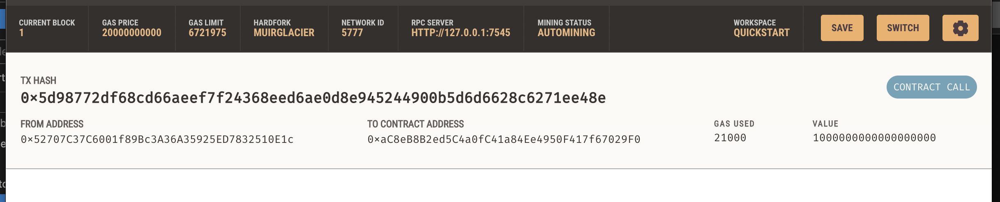
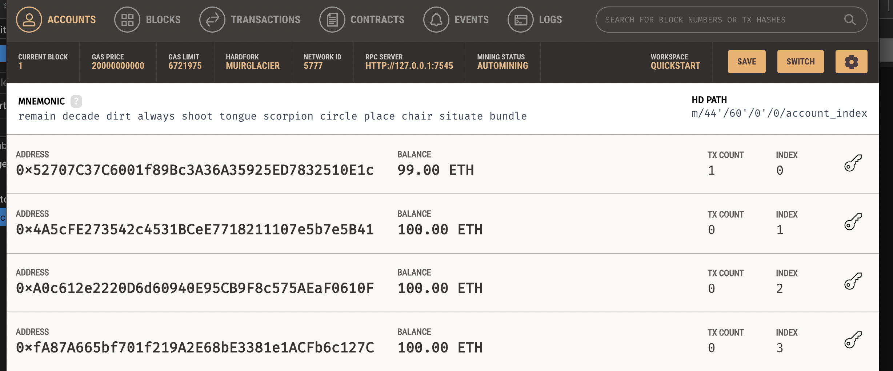

# Machine Learning Trading Alogrithm

This program utlizes Streamlit, Ganache, and Web3 to showcase blockchain wallet functionality through transactions to demo candidates. 

---

## Technologies

This project leverages Python 3.7 with the following packages:

* [Requests](https://pypi.org/project/requests/) - Allows you to send HTTP/1.1 requests

* [Bip44](https://pypi.org/project/bip44/) - Defines a logical hierarchy for deterministic wallets

* [Web3](https://pypi.org/project/web3/) - A Python library for interacting with Ethereum

* [Streamlit](https://pypi.org/project/streamlit/) - Streamlit lets you turn data scripts into shareable web apps

* [Ganache](https://trufflesuite.com/ganache/) - Ethereum blockchain which you can use to run tests, execute commands, and inspect state while controlling how the chain operates


---

## Installation Guide

Before running the application, first install the following dependencies.

```python
  pip install requests
  pip install bip44
  pip install web3
  pip install streamlit
```

---

## Examples

Upon running the application, you will see several locations to validate your transactions in Streamlit and Ganache





---

## Usage

To use the this python program, first open Ganache and start a temporary workspace. Copy your mnemonic phrase and add a .env file to the python directory with "MNEMONIC = "[INSERT MNEMONIC PHRASE HERE]"

Run the following command:

'''python
  python fintech_finder.py
'''

---

## Contributors

Pull requests are welcome. For major changes, please open an issue first to discuss what you would like to change.

Please make sure to update tests as appropriate.

---

## License

N/A